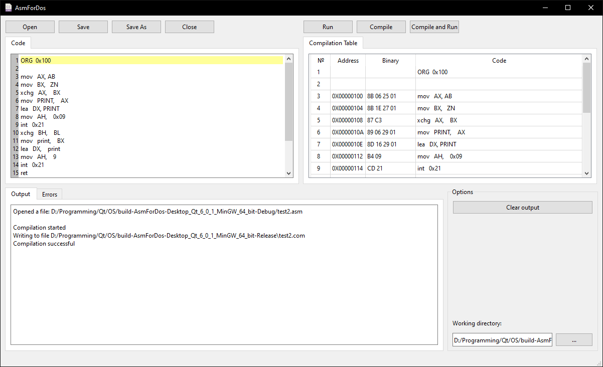

# AsmForDos
This software product is an Assembler Integrated Development Environment (IDE) for the DOS operating system. It allows you to write programs, check them for errors, run and view the hexadecimal representation of the executable code in a convenient way.

